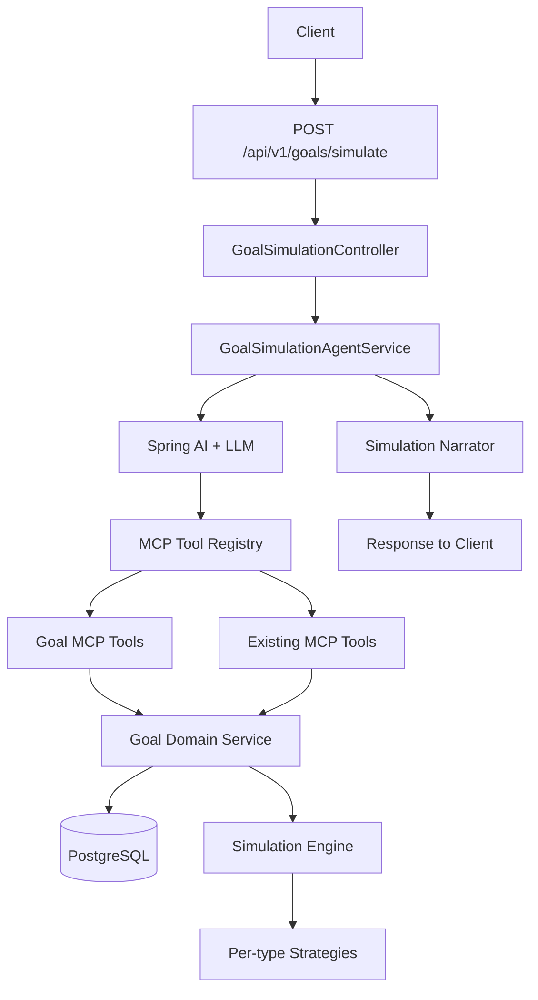

# Goal Simulation Roadmap

## Goal

Add an AI-driven financial goal simulation feature to SaveAPenny. The user writes a natural-language prompt describing a financial future goal (e.g. "I want to save $50,000 for a house down payment in 5 years"), the system extracts the goal, runs one or more calculations against the user's real financial data through the existing MCP tool layer, persists the goal and its scenarios, and reports the result back to the user with a clear, non-advisory summary.

The feature must plug into the existing architecture, not replace it. The assistant, MCP tool layer, security model, audit pipeline, and testing patterns already in `MCP_ROADMAP.md` Phases 1-4 are the foundation for this work.

## Scope Locked From Planning

- **Persistence**: persisted goals, scenarios, and simulation runs. Users can revisit, compare, and track progress.
- **Goal types in v1**: savings, debt payoff, purchase planning, retirement projection, income target. All five ship together.
- **AI orchestration**: tool-calling agent. The LLM extracts goal inputs and gathers user context through the existing MCP tool layer, then calls a `simulate_goal` tool and narrates the result.

## Why Now

The MCP tool layer is already in place. The assistant already orchestrates MCP tool calls. The data needed to power simulations is already exposed through MCP read tools (monthly summary, top spending, budget status, recent transactions, account balances). The remaining work is:

1. A new `goal` domain module for persistence and history.
2. A pure calculation engine for each goal type.
3. New MCP tools to expose goals and simulations.
4. An agent flow that connects user prompts to the engine.
5. Observability and safety for the new write surface.

## Target End State

- A user can POST a free-form goal prompt to a new endpoint and get a structured simulation back.
- The user's goals, scenarios, and run history are queryable through REST.
- The assistant can answer follow-up questions like "is my house goal on track?" by calling goal MCP tools.
- A scheduled job re-projects active goals and notifies the user when they fall behind.
- Tool risk classification, audit, rate limits, and correlation ids cover all goal-related mutations.

## Target Architecture



Existing pieces are reused:

- `com.saveapenny.mcp.execution` for the tool contract
- `com.saveapenny.mcp.registry` for tool registration
- `com.saveapenny.mcp.adapter.springai` for LLM access
- `com.saveapenny.assistant` prompt and chat patterns as a reference
- `com.saveapenny.audit` for ownership-scoped audit events
- `com.saveapenny.notification` for off-track alerts

## Design Decisions (Made Up Front)

1. **New domain module**: create `com.saveapenny.goal` parallel to `budget`, `transaction`, etc. The simulation engine is a sub-package of that module, not part of MCP.
2. **Tool layer over direct service access**: AI never touches `GoalRepository` directly. Every interaction goes through a registered MCP tool handler.
3. **Deterministic engine, agentic wrapper**: the math is pure and unit-testable. The LLM is only used for input extraction, context gathering, and final narration.
4. **Read-only first**: Phase 3 ships read tools first. Write tools only ship after the safety controls from Phase 7 are in place.
5. **Goal + Scenario + Run separation**:
   - `Goal`: the user's intent (target, type, horizon, currency, linked account).
   - `Scenario`: an alternative set of assumptions for a goal (different monthly contribution, different return rate).
   - `GoalRun`: an immutable snapshot of a simulation input + output, kept for history and comparison.
6. **Disclaimer is mandatory**: every assistant response that contains a simulation includes the standard non-advisory disclaimer that already exists in the assistant.
7. **Multi-currency**: goals store a currency. Projections are produced in the goal's currency. Cross-currency projections are out of scope for v1; if the goal currency differs from the primary account currency, the engine reports a warning and does not FX-convert.
8. **Embedded MCP, internal-only**: the simulation tools follow the same rule as the rest of the platform - they are not exposed as a public MCP transport.

## Phased Plan

Each phase ends with a milestone check. A phase is not "done" until its milestone is verified.

---

### Phase 0: Design Lock-In

**Goal**: align on the goal type taxonomy, scenario schema, and simulation output schema before any code is written.

Project changes: none, this phase produces design artifacts.

What should be produced:

- Goal type catalog with definitions, required inputs, and example prompts:
  - `SAVINGS`: target amount, target date, optional monthly contribution, optional expected return.
  - `DEBT_PAYOFF`: current balance, APR, minimum payment, target payoff date or monthly budget.
  - `PURCHASE`: target price, target date, current down payment, optional recurring saving rate.
  - `RETIREMENT`: current age, target retirement age, current retirement savings, target monthly income in retirement, expected return.
  - `INCOME_TARGET`: target monthly net income, target date, current average monthly net income.
- Scenario input schema: a versioned set of overridable parameters per goal type.
- Simulation output schema: per-type, but with a common envelope:
  - feasibility: `ON_TRACK`, `TIGHT`, `AT_RISK`, `INFEASIBLE`
  - required monthly contribution (or required change)
  - projected outcome at target date
  - month-by-month series (compressed for storage, full series for in-memory responses)
  - assumptions used
  - warnings (e.g. multi-currency, missing data, high APR, negative cash flow)
- Risk classification table per MCP tool.

Milestone checks:

- [ ] Goal type catalog reviewed and signed off.
- [ ] Scenario and output schemas written into a design addendum.
- [ ] Risk classification table agreed on.
- [ ] Open questions list (see end of doc) all answered or deferred.

Why first: changing the data model after the Flyway migration ships is expensive. Locking the shape before persistence prevents rework.

---

### Phase 1: Goal Domain Module (Persistence + CRUD)

**Goal**: stand up the `goal` module with persistence, ownership scoping, and REST CRUD, so the rest of the work has a place to store state.

Project changes:

- new package `com.saveapenny.goal`:
  - `entity` - `GoalEntity`, `ScenarioEntity`, `GoalRunEntity`
  - `repository` - `GoalRepository`, `ScenarioRepository`, `GoalRunRepository`
  - `service` - `GoalService`, `GoalMapper` (MapStruct)
  - `controller` - `GoalController` for CRUD
  - `dto` - request and response DTOs
  - `exception` - module-specific exceptions
- new Flyway migration `V{n}__create_goal_tables.sql`
- new config class for module wiring if needed
- new ownership-scoped queries, following the same patterns already used by `BudgetRepository` and `TransactionRepository`

Entity shape (high level):

- `GoalEntity`: `id`, `userId`, `type` (enum), `title`, `targetAmount`, `currency`, `targetDate`, `linkedAccountId` (nullable), `status` (`DRAFT`, `ACTIVE`, `ACHIEVED`, `ABANDONED`), `createdAt`, `updatedAt`.
- `ScenarioEntity`: `id`, `goalId`, `name`, `inputsJson`, `isBaseline`, `createdAt`.
- `GoalRunEntity`: `id`, `goalId`, `scenarioId`, `inputsSnapshotJson`, `outputJson`, `feasibility`, `createdAt` (immutable after insert).

REST endpoints (all under `/api/v1/goals`, all JWT-protected, all ownership-scoped):

- `POST /api/v1/goals` - create goal
- `GET /api/v1/goals` - list goals with pagination and filters
- `GET /api/v1/goals/{id}` - get goal with scenarios and latest run
- `PATCH /api/v1/goals/{id}` - update goal fields
- `DELETE /api/v1/goals/{id}` - soft delete
- `POST /api/v1/goals/{id}/scenarios` - add a scenario
- `GET /api/v1/goals/{id}/scenarios` - list scenarios
- `GET /api/v1/goals/{id}/runs` - paginated run history

Milestone checks:

- [ ] Migration runs cleanly on a fresh DB and on a DB upgraded from the previous schema.
- [ ] All eight endpoints return correct shapes and reject cross-user access with `404`.
- [ ] `GoalService` is covered by unit tests for create, update, list, ownership check, and not-found.
- [ ] Integration test `GoalFlowIntegrationTest` passes against Testcontainers PostgreSQL.
- [ ] OpenAPI schema in `/v3/api-docs` includes the new endpoints.
- [ ] No code outside the new module references the new entities directly.

Why first: nothing else can be tested end to end without persistence. The agent cannot save a goal, the run history cannot exist, and progress tracking has nothing to track.

---

### Phase 2: Simulation Engine (Pure, No AI)

**Goal**: build the deterministic calculation core that turns a `Goal` + `Scenario` into a `SimulationResult`. The engine is the part that must be correct before the AI wrapper is built.

Project changes:

- new package `com.saveapenny.goal.simulation`:
  - `SimulationEngine` - orchestrator, picks the right strategy
  - `SimulationInput` - normalized DTO consumed by strategies
  - `SimulationResult` - normalized result envelope
  - `Feasibility` enum
  - `MonthlyProjectionPoint` - one point in the month-by-month series
  - `AssumptionSet` - explicit, recorded assumptions
  - `Warning` - structured warning model
- one strategy class per goal type:
  - `SavingsGoalStrategy`
  - `DebtPayoffGoalStrategy`
  - `PurchasePlanningGoalStrategy`
  - `RetirementGoalStrategy`
  - `IncomeTargetGoalStrategy`
- shared utilities in `com.saveapenny.goal.simulation.math` for time-value-of-money, amortization, and contribution scheduling

Each strategy implements:

```
SimulationResult simulate(SimulationInput input, AssumptionSet assumptions)
```

The engine is pure:

- no Spring beans inside the math
- no DB access inside the math
- no clock - all dates are passed in
- all assumptions are explicit inputs

Reading user data (accounts, transactions, income averages) is a separate service, `GoalContextProvider`, that the engine's orchestrator calls before invoking a strategy. This keeps the math testable with hand-built inputs.

Milestone checks:

- [ ] Unit tests cover at least 3 cases per strategy: easy feasibility, tight feasibility, infeasible.
- [ ] Edge case tests: zero APR, zero contribution, very long horizon (>40 years), leap years, end-of-month boundary dates, currency mismatch warnings.
- [ ] `SimulationResult` includes a feasibility enum, required monthly contribution, projected outcome, assumptions, warnings, and a month-by-month series.
- [ ] No strategy imports from `com.saveapenny.goal.repository`. Strategies can be tested without a Spring context.
- [ ] The engine can be called directly from a JUnit test and produce identical output for identical input.

Why first: a wrong simulation reported confidently is worse than no simulation. The engine must be correct and unit-testable before the LLM ever calls it.

---

### Phase 3: MCP Read Tools for Goals

**Goal**: expose goal state to the agent through the existing MCP tool layer. Read-only first per the platform's safety policy.

Project changes:

- new package `com.saveapenny.mcp.goal`:
  - `GetGoalToolHandler` + input + result DTOs
  - `ListGoalsToolHandler` + input + result DTOs
  - `GetGoalProgressToolHandler` + input + result DTOs (current vs projection)
  - `ListGoalScenariosToolHandler`
  - `ListGoalRunsToolHandler`
- registration in `InMemoryToolRegistry`
- Spring AI adapter exposure in `com.saveapenny.mcp.adapter.springai` so the assistant can call them

Each tool follows the contract already in use:

- `ToolDefinition` with stable name, versioned description, input schema, output schema
- `ToolHandler<I, O>` with strict input validation
- `ToolResult<T>` envelope with explicit success or error
- auth propagation through `ToolExecutionContext`

Milestone checks:

- [ ] All read tools registered and discoverable through `ToolRegistry`.
- [ ] Each tool has stable name, JSON-style input schema, JSON-style output schema.
- [ ] Validation rejects missing required fields with `VALIDATION_ERROR`.
- [ ] Cross-user access attempts return `NOT_FOUND`, never leak the existence of another user's goal.
- [ ] Assistant can call at least `list_goals` and `get_goal` in a chat session and receive structured results.
- [ ] Unit and integration tests for each handler, including auth and validation.

Why first: the agent needs to read the user's existing goals to answer "is my house goal on track?". Read tools carry no mutation risk, so they ship without the heavier safety work in Phase 7.

---

### Phase 4: Simulation MCP Tool + Agent Endpoint

**Goal**: connect the engine to the agent. The user can now prompt a goal and get a simulation.

Project changes:

- new package `com.saveapenny.mcp.goal`:
  - `SimulateGoalToolHandler` - calls `GoalSimulationService` and returns the structured result
- new package `com.saveapenny.goal.service`:
  - `GoalSimulationService` - wires `GoalContextProvider` to the engine and to the read tools
  - `GoalContextProvider` - gathers the user's accounts, recent transactions, average income, and budget status needed for projections
- new package `com.saveapenny.assistant.goal` (or extension of existing `assistant` package):
  - `GoalSimulationAgentService` - builds the system prompt, exposes the available tools to Spring AI, handles the chat loop
  - prompt templates in `src/main/resources/prompts/goal-simulation/`
- new controller endpoint:
  - `POST /api/v1/goals/simulate` - takes a free-form prompt, returns the parsed goal, the simulation result, and the assistant narrative
  - `POST /api/v1/goals/{id}/simulate` - re-runs the simulation for an existing goal
  - `POST /api/v1/goals/simulate/draft` - preview without persisting (useful for "is this even possible?" prompts)

Agent flow:

1. Receive prompt.
2. LLM extracts goal type and parameters.
3. LLM calls `simulate_goal` tool with a draft input.
4. Tool calls `GoalContextProvider` to enrich the input with real user data.
5. Tool calls the engine.
6. Tool returns a structured `SimulationResult` plus a draft `Goal` (not yet persisted).
7. LLM narrates the result with the standard disclaimer.
8. If the user confirms, the agent calls `create_goal` and `create_run`.

Milestone checks:

- [ ] End-to-end test: a user posts "I want to save $20,000 in 3 years", the system returns a feasibility, required monthly contribution, projection series, and a narrative.
- [ ] The draft endpoint does not write to the database.
- [ ] The persist endpoint creates a `GoalEntity`, a baseline `ScenarioEntity`, and a `GoalRunEntity` in one transaction.
- [ ] The agent prompt refuses to give financial advice and always includes the disclaimer when narrating a simulation.
- [ ] Validation: invalid goal type, impossible horizon, or negative amount returns `VALIDATION_ERROR` from the tool, not a 500.
- [ ] The assistant in the existing `/api/v1/assistant/chat` can answer "what's my savings goal status?" using the new read tools.

Why fourth: by this point the engine is correct, the read tools are proven, and the agent has a stable surface. The riskiest parts (math and LLM orchestration) are now in flight together with safety, not after.

---

### Phase 5: Scenarios, Comparison, and What-If

**Goal**: let users explore alternatives without losing the baseline.

Project changes:

- `CreateScenarioToolHandler` (low-risk write)
- `CompareScenariosToolHandler` (read)
- `WhatIfToolHandler` (read) - accepts a goal id and an override, returns a projected delta without persisting
- controller endpoints:
  - `POST /api/v1/goals/{id}/scenarios/compare`
  - `POST /api/v1/goals/{id}/what-if`
- agent prompt updates: "what if I save $500 more a month?"

Milestone checks:

- [ ] A user can save a second scenario under the same goal and view both side by side.
- [ ] Comparison response highlights deltas in feasibility, required monthly contribution, and final outcome.
- [ ] What-if does not persist anything; the response is tagged as a projection only.
- [ ] The agent can run a what-if during chat without violating the no-public-MCP rule.

Why fifth: this is the most user-visible "feel" of the feature. It depends on the engine, the read tools, and the simulation tool all being solid.

---

### Phase 6: Progress Tracking and Off-Track Alerts

**Goal**: turn a goal from a one-shot calculation into a tracked, living plan.

Project changes:

- new scheduler job `GoalProgressJob` in `com.saveapenny.automation` or a new `com.saveapenny.goal.scheduler` package
- new strategy `GoalProgressCalculator` that, given a goal, a scenario, and the user's recent transactions, produces a current-vs-projection delta
- new notification type `GOAL_OFF_TRACK` registered with the existing notification module
- new MCP tool `GetGoalProgressToolHandler` (already added in Phase 3) extended to also flag off-track status
- assistant prompt update: "am I on track for X?" returns the progress plus the alert status

Milestone checks:

- [ ] Job runs on a configurable schedule (default nightly) and only for `ACTIVE` goals.
- [ ] Off-track threshold is configurable per goal type and defaults to a sensible value (for example, 10% behind projection for two consecutive months).
- [ ] Notification is created with the goal title, current shortfall, and a link back to the goal.
- [ ] Re-running the job is idempotent - it does not create duplicate notifications for the same off-track state.
- [ ] The existing `GET /api/v1/notifications` endpoint shows the new alert type.

Why sixth: this is the part that makes the feature sticky. It is also the part that creates the most ongoing cost, so it lands after the core flow is stable.

---

### Phase 7: Safety, Observability, and Governance

**Goal**: ship the write tools for goals and scenarios with the same safety posture as the rest of the platform.

Project changes:

- extend `com.saveapenny.mcp.security` with risk classification:
  - read-only (always allowed): `list_goals`, `get_goal`, `get_goal_progress`, `list_goal_runs`
  - low-risk write (allowed with audit): `create_goal`, `create_scenario`
  - high-impact write (requires explicit `confirm=true` in input): `delete_goal`, `update_goal_baseline`, `apply_scenario_as_baseline`
- audit events for every goal write, routed through the existing audit module
- correlation id and request id propagated through agent, tool registry, engine, and DB writes
- per-user and per-tool rate limits for `simulate_goal` (for example, 30 per hour per user)
- counters and timers exposed through Micrometer: `goal_simulation_total{type, feasibility}`, `goal_simulation_duration_seconds{type}`, `goal_simulation_errors_total{type, error_code}`
- structured logging with redacted PII for goal titles and amounts at the log layer

Milestone checks:

- [ ] Every write tool has a documented risk class in its `ToolDefinition`.
- [ ] High-impact writes reject calls without `confirm=true`.
- [ ] Audit log shows goal create, update, delete, scenario create, scenario apply.
- [ ] Metrics visible at `/actuator/metrics`.
- [ ] Rate limit returns `RATE_LIMITED` once exceeded and does not run the engine.
- [ ] Logs do not include raw account numbers, full goal titles, or full amounts at INFO level.

Why seventh: this is the boring work that lets the feature go to production. It lands after the agent is in place so it covers the real surfaces.

---

### Phase 8: Documentation, Onboarding, and Polish

**Goal**: make the feature discoverable and understandable for users and maintainers.

Project changes:

- `README.md` updated with the goal simulation feature row and example prompt.
- `USER-GUIDE.md` updated with a "Goal Simulation" section, examples, and the disclaimer.
- `api-contract.md` extended with the new endpoints and example responses.
- `technical-doc.md` extended with the goal module architecture, the engine, and the agent flow.
- example prompts in `src/main/resources/prompts/goal-simulation/examples.json` for tests and docs.

Milestone checks:

- [ ] All four docs merged.
- [ ] At least three example prompts from the docs are covered by integration tests.
- [ ] OpenAPI examples show realistic request and response bodies.

Why last: documentation is only useful when the feature works. Writing it after the code is solid means the examples match the real behavior.

---

## Testing Strategy

The testing pattern follows `MCP_ROADMAP.md`. Three layers.

### Unit tests

- each simulation strategy
- `GoalContextProvider` with mocked services
- input validators for every tool
- risk policy enforcement for write tools
- mapping between DTOs and entities

### Integration tests

- `GoalFlowIntegrationTest` covering the new REST endpoints
- `GoalSimulationFlowIntegrationTest` covering the agent endpoint end to end
- `GoalProgressIntegrationTest` covering the scheduler
- MCP tool integration tests for read and write tools, including auth and ownership

### Contract tests

- tool name and schema stability for all new tools
- simulation output schema stability per goal type
- OpenAPI schema coverage for the new endpoints

Regression coverage must include:

- empty transaction history
- missing linked account
- mixed-currency accounts with a goal in a third currency
- very long horizons
- very short horizons (under 1 month)
- off-track, on-track, and infeasible scenarios
- concurrent simulation runs for the same goal

## Risks and Mitigations

- **Risk**: LLM extracts a wrong goal type or wrong amount.
  - **Mitigation**: every `simulate_goal` call returns the parsed input, and the agent surfaces it back to the user for confirmation before persisting.
- **Risk**: simulation output gives the user a false sense of certainty.
  - **Mitigation**: mandatory disclaimer, explicit assumption listing, structured warnings for missing data.
- **Risk**: agent calls write tools without intent.
  - **Mitigation**: read-only tools first, write tools require explicit confirm flag, audit trail covers all writes, rate limits prevent runaway cost.
- **Risk**: progress tracking generates notification spam.
  - **Mitigation**: idempotent off-track state in the run record, configurable threshold, opt-out per goal.
- **Risk**: schema drift between engine and tool output.
  - **Mitigation**: shared `SimulationResult` model is the single source of truth. The engine produces it, the tool returns it, the contract test asserts it.

## What Not To Do

- do not expose `GoalRepository` as a tool. AI goes through MCP handlers.
- do not let the LLM do math. The engine is deterministic; the LLM only narrates.
- do not ship write tools before the safety controls in Phase 7.
- do not store the full month-by-month series in the DB. Store a compressed summary in `GoalRunEntity` and only emit the full series in API responses.
- do not use chat persistence as the only record of a simulation. The simulation must live in `GoalRunEntity` so it survives chat cleanup.
- do not skip the disclaimer in the narrator.

## First Implementation Slice

When implementation starts, the recommended order is:

1. Phase 0 design lock-in.
2. Phase 1 domain module, including the Flyway migration.
3. Phase 2 engine with at least the `SAVINGS` and `DEBT_PAYOFF` strategies passing unit tests.
4. Phase 3 read tools so the engine output is reachable through MCP.
5. Phase 4 minimal agent endpoint for `SAVINGS` only, behind a feature flag.
6. Then add the remaining goal types, scenarios, progress, and the rest of the roadmap in order.

The reason to ship a thin `SAVINGS` slice first is that it exercises every layer (domain, engine, MCP, agent, REST, tests) with the smallest math surface, which means bugs in the plumbing are caught before the more complex goal types are added.

## Open Questions To Resolve In Phase 0

- Should `Scenario` allow overriding the goal type, or only parameters?
- What is the default expected return rate for `SAVINGS` and `RETIREMENT`? (Recommend user-provided, with a documented default if missing.)
- Should the agent support voice or multi-message goal refinement, or only single-prompt v1?
- Should the scheduler opt users in by default or require explicit activation?
- Is there a product requirement to limit goal types per user tier?
- How should we handle a user with zero accounts or zero transactions when they prompt a goal? (Recommend: still allow simulation, but mark result as "based on default assumptions".)
