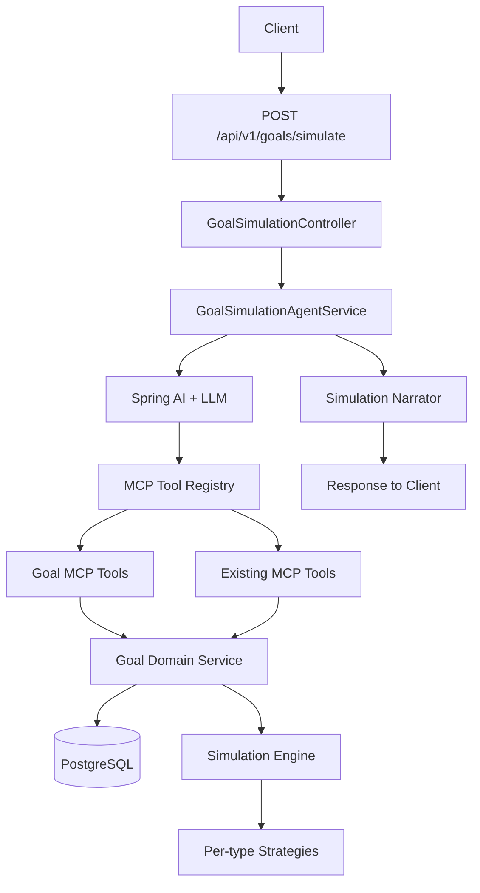

# Goal Simulation Roadmap

## Goal

Add an AI-driven financial goal simulation feature to SaveAPenny. The user writes a natural-language prompt describing a future financial goal, the system extracts the goal, runs calculations against the user's financial context through the existing MCP tool layer, persists the goal and its scenarios when the user confirms, and reports the result back with a clear, non-advisory summary.

The feature must plug into the existing architecture, not replace it. The assistant, MCP tool layer, security model, audit pipeline, and testing patterns already in `MCP_ROADMAP.md` are the foundation.

## Scope Locked From Planning

- **Persistence**: persisted goals, scenarios, and simulation runs.
- **Goal types in v1**: `SAVINGS`, `DEBT_PAYOFF`, `PURCHASE`, `RETIREMENT`, `INCOME_TARGET`.
- **AI orchestration**: tool-calling agent. The LLM extracts inputs, gathers context through MCP, calls a simulation tool, and narrates the result.

## Why Now

The MCP tool layer and assistant orchestration already exist. The data needed for simulations is already available through read surfaces such as account balances, transaction history, and budget context.

The missing pieces are:

1. A `goal` domain module for persistence and history.
2. A deterministic simulation engine.
3. Goal-specific MCP tools.
4. An agent flow that connects user prompts to the engine.
5. Safety and observability for goal mutations.

## Target End State

- A user can submit a goal prompt and receive a structured simulation.
- Goals, scenarios, and run history are queryable through REST.
- The assistant can answer follow-up questions such as "is my house goal on track?".
- Active goals are periodically re-evaluated and can trigger off-track notifications.
- Goal-related tool writes are covered by risk classification, audit, rate limits, and correlation ids.

## Target Architecture

Existing platform pieces reused:

- `com.saveapenny.mcp.execution`
- `com.saveapenny.mcp.registry`
- `com.saveapenny.mcp.adapter.springai`
- `com.saveapenny.assistant`
- `com.saveapenny.audit`
- `com.saveapenny.notification`

## Design Decisions

1. **New domain module**: create `com.saveapenny.goal` parallel to `budget`, `transaction`, and the other domains.
2. **Tool layer over direct repository access**: AI never talks to repositories directly.
3. **Deterministic engine, agentic wrapper**: the engine does the math; the LLM extracts, asks, and narrates.
4. **Read-first rollout**: read tools ship before broader write governance, but limited low-risk writes needed to persist a user-confirmed simulation may ship earlier with ownership checks, audit, and explicit confirmation.
5. **Goal / Scenario / Run separation**: user intent, alternative assumptions, and immutable execution history stay distinct.
6. **Disclaimer is mandatory**: every simulation narrative includes the platform disclaimer.
7. **Multi-currency is warning-only in v1**: goals have a currency, but v1 does not perform FX conversion.
8. **Embedded MCP only**: tools remain internal platform surfaces, not public MCP transport.

## Phased Plan

Each phase ends with a milestone check. A phase is not done until its milestone is verified.

---

### Phase 0: Design Lock-In

**Goal**: lock the contracts before any implementation begins.

Deliverables:

- goal type catalog with required inputs, defaults, feasibility rules, and example prompts
- scenario input schema
- simulation output schema
- tool catalog and risk classification
- open questions resolved or explicitly deferred

Milestone checks:

- [x] Goal type catalog reviewed and signed off.
- [x] Scenario and output schemas written into the design document.
- [x] Risk classification table agreed on.
- [x] Open questions resolved or deferred.

Why first: changing the model after persistence ships is expensive.

---

### Phase 1: Goal Domain Module (Persistence + CRUD)

**Goal**: stand up the `goal` module with persistence, ownership scoping, and REST CRUD.

Project changes:

- new package `com.saveapenny.goal`
  - `entity` - `GoalEntity`, `ScenarioEntity`, `GoalRunEntity`
  - `repository` - `GoalRepository`, `ScenarioRepository`, `GoalRunRepository`
  - `service` - `GoalService`, `GoalMapper`
  - `controller` - `GoalController`
  - `dto` - request and response DTOs
  - `exception` - module-specific exceptions
- new Flyway migration `V{n}__create_goal_tables.sql`
- ownership-scoped repository methods and service logic

REST endpoints under `/api/v1/goals`:

- `POST /api/v1/goals`
- `GET /api/v1/goals`
- `GET /api/v1/goals/{id}`
- `PATCH /api/v1/goals/{id}`
- `DELETE /api/v1/goals/{id}`
- `PATCH /api/v1/goals/{id}/status`
- `POST /api/v1/goals/{id}/scenarios`
- `GET /api/v1/goals/{id}/scenarios`
- `GET /api/v1/goals/{id}/runs`

Milestone checks:

- [ ] Migration runs cleanly on a fresh DB and on upgrade.
- [x] All nine implemented endpoints return correct shapes and reject cross-user access with `404`.
- [x] `GoalService` has unit coverage for create, update, list, ownership check, and not-found.
- [x] `GoalFlowIntegrationTest` passes against H2 in PostgreSQL mode.
- [ ] OpenAPI includes the new endpoints.
- [x] No code outside the new module references goal entities directly.

Implementation notes:

- A dedicated `PATCH /api/v1/goals/{id}/status` endpoint was added so lifecycle transitions stay separate from general partial updates.
- Soft delete is implemented with `deleted_at` on `goals`.
- JSON payloads are stored as text in the Phase 1 migration, while remaining structured JSON at the API layer.
- `GoalRunEntity` persistence exists, but Phase 1 does not create runs yet because the simulation engine lands in Phase 2 and later phases.

---

### Phase 2: Simulation Engine (Pure, No AI)

**Goal**: build the deterministic calculation core.

Project changes:

- new package `com.saveapenny.goal.simulation`
  - `SimulationEngine`
  - `SimulationInput`
  - `SimulationResult`
  - `Feasibility`
  - `MonthlyProjectionPoint`
  - `AssumptionSet`
  - `Warning`
- one strategy per goal type
- shared math utilities for compounding, amortization, and schedules

Rules:

- no Spring beans inside math code
- no DB access inside math code
- no hidden clock access
- all assumptions explicit

Milestone checks:

- [x] At least 3 unit cases per strategy: easy, tight, infeasible.
- [ ] Edge cases covered: zero APR, zero contribution, long horizon, leap years, end-of-month boundaries, currency mismatch warnings.
- [x] `SimulationResult` includes feasibility, required change, projected outcome, assumptions, warnings, and a month-by-month series.
- [x] No strategy imports from repository packages.
- [ ] Identical input produces identical output.

Implementation notes:

- The pure engine now exists under `com.saveapenny.goal.simulation` with five strategies and shared math helpers.
- The engine is plain Java: no Spring annotations, no repository access, and no hidden clock access inside the strategies.
- `Feasibility` is reused from `com.saveapenny.goal.entity` so the persistence layer and engine share one enum.
- Per-strategy unit coverage is in place, but the edge-case matrix is not complete yet.

---

### Phase 3: MCP Read Tools for Goals

**Goal**: expose goal state to the assistant through the existing MCP layer.

Project changes:

- new package `com.saveapenny.mcp.goal`
  - `GetGoalToolHandler`
  - `ListGoalsToolHandler`
  - `GetGoalProgressToolHandler`
  - `ListGoalScenariosToolHandler`
  - `ListGoalRunsToolHandler`
- tool registration in the registry
- Spring AI adapter exposure

Milestone checks:

- [x] All read tools are registered and discoverable.
- [x] Each tool has stable name, input schema, and output schema.
- [x] Validation rejects missing required fields with `VALIDATION_ERROR`.
- [x] Cross-user access returns `NOT_FOUND`.
- [x] The assistant can call at least `list_goals` and `get_goal` successfully.
- [x] Unit and integration coverage exists for each handler.

Implementation notes:

- Goal MCP read tools now live under `com.saveapenny.mcp.goal`.
- The Spring AI adapter exposes all five read tools to the assistant layer.
- `get_goal_progress` currently returns a stable placeholder `NO_PROJECTION` result when no run exists, and will be refined in Phase 6.
- Goal tool names follow the goal-simulation contract in snake_case.

---

### Phase 4: Simulation MCP Tool + Agent Endpoint

**Goal**: connect the engine to the assistant.

Project changes:

- `SimulateGoalToolHandler`
- `GoalSimulationService`
- `GoalContextProvider`
- `GoalSimulationAgentService`
- prompt templates under `src/main/resources/prompts/goal-simulation/`
- endpoints:
  - `POST /api/v1/goals/simulate`
  - `POST /api/v1/goals/{id}/simulate`
  - `POST /api/v1/goals/simulate/draft`

Agent flow:

1. Receive prompt.
2. Extract goal type and parameters.
3. Call `simulate_goal` with a draft input.
4. Enrich with user context.
5. Run the engine.
6. Return a structured `SimulationResult` and draft goal state.
7. Narrate the result with disclaimer.
8. If the user confirms in a separate user turn, call the low-risk persistence path to create the goal, baseline scenario, and initial run in one transaction.

Milestone checks:

- [x] End-to-end test for a simple savings prompt returns feasibility, required contribution, series, and narrative.
- [x] The draft endpoint does not write to the database.
- [ ] The persist path writes goal, baseline scenario, and initial run in one transaction after explicit confirmation.
- [x] The simulation response includes the standard disclaimer.
- [x] Validation failures return a stable bad-request error instead of a `500`.
- [ ] The existing assistant can answer new free-form goal simulation prompts through the main chat flow.

Implementation notes:

- A read-only `simulate_goal` MCP tool now exists for existing goals.
- `GoalSimulationServiceImpl` wires the pure engine to user context and persisted goal inputs.
- `POST /api/v1/goals/simulate`, `POST /api/v1/goals/simulate/draft`, and `POST /api/v1/goals/{id}/simulate` are implemented.
- The free-form prompt path is currently a deterministic `SAVINGS` parser rather than a full LLM extraction loop.
- Persistence-after-confirm remains future work.

---

### Phase 5: Scenarios, Comparison, and What-If

**Goal**: let users explore alternatives without losing the baseline.

Project changes:

- `CreateScenarioToolHandler`
- `CompareScenariosToolHandler`
- `WhatIfToolHandler`
- endpoints:
  - `POST /api/v1/goals/{id}/scenarios/compare`
  - `POST /api/v1/goals/{id}/what-if`

Milestone checks:

- [x] A user can save a second scenario under the same goal.
- [x] Comparison highlights deltas in feasibility, required contribution, and projected outcome.
- [x] What-if is explicitly non-persistent.
- [x] The assistant can run compare and what-if through internal MCP only.

Implementation notes:

- `POST /api/v1/goals/{id}/scenarios/compare` and `POST /api/v1/goals/{id}/what-if` are implemented.
- `compare_scenarios` and `what_if` MCP handlers are implemented and exposed through `SpringAiMcpToolAdapter`.
- Comparison is deterministic: baseline first, then `createdAt`, with a ten-scenario cap.
- What-if merges flat overrides into the goal input `values` object and never persists a scenario or a run.

---

### Phase 6: Progress Tracking and Off-Track Alerts

**Goal**: turn goals into tracked, living plans.

Project changes:

- `GoalProgressJob`
- `GoalProgressCalculator`
- notification type `GOAL_OFF_TRACK`
- `GetGoalProgressToolHandler` extension
- assistant prompt update for on-track questions

Milestone checks:

- [x] Job runs on a configurable schedule and only for `ACTIVE` goals.
- [x] Off-track threshold is configurable and defaults to 10% behind projection for two consecutive scheduler runs.
- [x] Notifications include goal title and shortfall context.
- [x] Re-running the job is idempotent for the same unread off-track episode.
- [x] The existing notification API supports the new `GOAL_OFF_TRACK` alert type.

Implementation notes:

- `GoalProgressCalculatorImpl` is now the source of truth for `get_goal_progress`.
- `GoalProgressJob` evaluates all active goals on the configured cron.
- `GoalOffTrackNotifier` uses unread-notification existence plus the configured persistence threshold as its idempotency gate.
- The scheduler currently keeps consecutive off-track streaks in memory.
- `V12__add_goal_off_track_notification_type.sql` extends the notification type constraint for the new alert.

---

### Phase 7: Safety, Observability, and Governance

**Goal**: harden the goal write surface for production.

Project changes:

- risk classification enforcement in `com.saveapenny.mcp.security`
- audit events for goal writes
- correlation id propagation
- per-user and per-tool rate limits
- Micrometer metrics
- structured logging with redacted PII

Milestone checks:

- [ ] Every write tool has a documented risk class.
- [ ] High-impact writes reject calls without `confirm=true`.
- [ ] Audit logs show goal and scenario mutations.
- [ ] Metrics are visible through the actuator.
- [ ] Rate limiting returns `RATE_LIMITED` before engine execution.
- [ ] INFO logs do not contain raw sensitive values.

---

### Phase 8: Documentation, Onboarding, and Polish

**Goal**: make the feature discoverable for users and maintainers.

Project changes:

- update `README.md`
- update `USER-GUIDE.md`
- extend `api-contract.md`
- extend `technical-doc.md`
- add prompt examples in `src/main/resources/prompts/goal-simulation/examples.json`

Milestone checks:

- [ ] All docs merged.
- [ ] At least three documented prompts are covered by tests.
- [ ] OpenAPI examples show realistic request and response bodies.

## Testing Strategy

Three layers:

### Unit tests

- each simulation strategy
- `GoalContextProvider` with mocked dependencies
- tool validators
- risk policy enforcement
- DTO/entity mapping

### Integration tests

- `GoalFlowIntegrationTest`
- `GoalSimulationFlowIntegrationTest`
- `GoalProgressIntegrationTest`
- MCP tool integration tests including auth and ownership

### Contract tests

- tool name and schema stability
- simulation output schema stability
- OpenAPI coverage for the new endpoints

Regression coverage must include:

- empty transaction history
- missing linked account
- mixed-currency data
- very long horizons
- very short horizons
- off-track, on-track, and infeasible scenarios
- concurrent simulation runs for the same goal

## Risks and Mitigations

- **Risk**: LLM extracts the wrong type or amount.
  - **Mitigation**: the parsed input is surfaced to the user before persistence.
- **Risk**: simulation output creates false certainty.
  - **Mitigation**: mandatory disclaimer, explicit assumptions, structured warnings.
- **Risk**: the agent writes without user intent.
  - **Mitigation**: confirmation gate, audit trail, ownership checks, risk policy.
- **Risk**: progress tracking generates noise.
  - **Mitigation**: idempotent notifications and configurable thresholds.
- **Risk**: schema drift between engine and tool output.
  - **Mitigation**: one shared `SimulationResult` model.

## What Not To Do

- do not expose repositories as tools
- do not let the LLM do math
- do not store the full series by default for every run
- do not use chat persistence as the only simulation history
- do not skip the disclaimer

## First Implementation Slice

Recommended order:

1. Phase 0 design lock-in.
2. Phase 1 persistence and CRUD.
3. Phase 2 engine with `SAVINGS` and `DEBT_PAYOFF` first.
4. Phase 3 read tools.
5. Phase 4 a minimal `SAVINGS` simulation path behind a feature flag.
6. Then add remaining goal types and later phases in order.

The thin `SAVINGS` slice is the preferred first implementation because it exercises every architectural layer with the smallest math surface.

## Open Questions To Resolve In Phase 0

- Should scenarios override goal type or only parameters?
- What are the documented defaults for `SAVINGS` and `RETIREMENT` returns?
- Should the agent support multi-message refinement in v1?
- Should progress tracking be default-on or explicit opt-in?
- Are goal types limited by user tier?
- How should simulations behave for users with zero accounts or zero transactions?

These questions are considered closed only after the answers are recorded in `GOAL_SIMULATION_DESIGN.md`.
