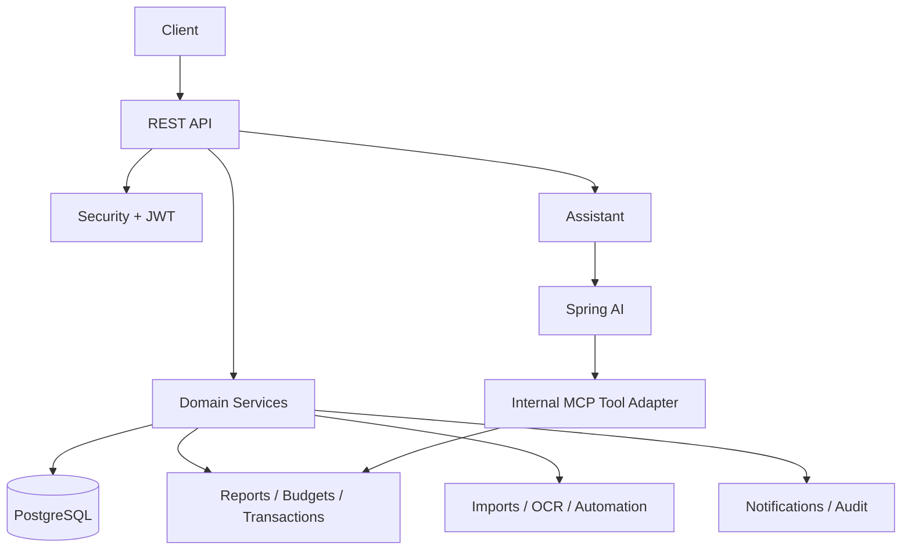

# SaveAPenny


SaveAPenny is a personal finance backend built with Spring Boot.

It helps users track money, manage budgets, import financial data, and chat with an AI assistant that can use real account data instead of only prompt text.

## Why It Is Interesting

- more than a CRUD demo: includes reporting, automation, OCR, audit logging, and AI integration
- modular backend design with clear domain boundaries
- secure JWT-based API with user-scoped access rules
- assistant features backed by internal MCP-style tool handlers
- practical engineering concerns included: async jobs, validation, error handling, tests, and migrations

## What Users Can Do

- create and manage accounts
- organize income and expenses with categories
- record transactions and transfers
- set monthly and yearly budgets
- review summaries, category spending, cash flow, and net worth
- automate recurring transactions
- import transactions from CSV files
- extract transaction candidates from receipts or PDFs with OCR
- read notifications and audit history
- ask an AI assistant budgeting questions

## Feature Overview

| Feature | What it covers |
| --- | --- |
| Auth | Register, login, refresh, logout |
| Accounts | Ownership-scoped financial accounts |
| Categories | System and user-defined categories |
| Transactions | Income, expense, transfer, filtering |
| Budgets | Monthly and yearly budget tracking |
| Reports | Summary, spending, cash flow, net worth |
| Automation | Recurring transaction scheduling |
| Notifications | In-app notifications and unread count |
| Imports | CSV preview, async confirm, duplicate detection |
| OCR | Receipt/document parsing with Tesseract |
| Audit | Ownership-scoped audit logs |
| Assistant | Spring AI chat with internal tool-calling |

## Architecture Snapshot



## Quick Product Examples

### Create A Transaction

```http
POST /api/v1/transactions
Authorization: Bearer <accessToken>
Content-Type: application/json

{
  "accountId": "11111111-1111-1111-1111-111111111111",
  "categoryId": "22222222-2222-2222-2222-222222222222",
  "type": "EXPENSE",
  "amount": 145.75,
  "currency": "TRY",
  "description": "Groceries",
  "transactionDate": "2026-06-05"
}
```

### Ask The Assistant

```http
POST /api/v1/assistant/chat
Authorization: Bearer <accessToken>
Content-Type: application/json

{
  "message": "Where am I spending the most this month?"
}
```

Example response shape:

```json
{
  "success": true,
  "data": {
    "sessionId": "44444444-4444-4444-4444-444444444444",
    "reply": "Your highest spending this month is in Food, followed by Transport.",
    "disclaimer": "This assistant provides general budgeting guidance, not financial, tax, or legal advice."
  },
  "error": null,
  "timestamp": "2026-06-05T12:00:00Z"
}
```

## Main API Areas

| Area | Endpoints |
| --- | --- |
| Auth | `/api/v1/auth/*` |
| Accounts | `/api/v1/accounts` |
| Categories | `/api/v1/categories` |
| Transactions | `/api/v1/transactions` |
| Budgets | `/api/v1/budgets` |
| Reports | `/api/v1/reports` |
| Automation | `/api/v1/automations/recurring-transactions` |
| Notifications | `/api/v1/notifications` |
| Imports | `/api/v1/imports/transactions` |
| OCR | `/api/imports/ocr` |
| Audit | `/api/v1/audits` |
| Assistant | `/api/v1/assistant/chat` |

Protected endpoints require:

```text
Authorization: Bearer <accessToken>
```

## Current Status

- Auth: complete
- Accounts: complete
- Categories: complete
- Transactions: complete
- Budgets: complete
- Reports: partial CSV export coverage
- Automation: complete
- Notifications: partial event/email/preferences support pending
- Imports: complete
- OCR: complete
- Audit: complete
- Assistant: complete for backend MVP and tool-calling

## Tech Stack

- Java 24
- Spring Boot 3.5
- Spring Security
- Spring Data JPA
- PostgreSQL
- Flyway
- Spring AI
- Tess4J / Tesseract OCR
- JUnit 5, Mockito, Testcontainers, Rest Assured

## Run Locally

### Prerequisites

- Java 24
- PostgreSQL
- Maven
- Tesseract if OCR is enabled

### Required Environment Variables

- `DB_USERNAME`
- `DB_PASSWORD`
- `JWT_SECRET`
- `ASSISTANT_ENABLED`
- `ASSISTANT_AI_PROVIDER`
- `OPENAI_API_KEY` when using OpenAI
- `OPENROUTER_API_KEY` when using OpenRouter

### Start The App

```bash
mvn spring-boot:run
```

Useful URLs after startup:

- Swagger UI: `http://localhost:8080/swagger-ui.html`
- OpenAPI docs: `http://localhost:8080/v3/api-docs`
- Health: `http://localhost:8080/actuator/health`

## OCR Setup

The OCR pipeline uses `tess4j`, so native Tesseract binaries and tessdata files must exist on the machine.

macOS setup:

```bash
brew install tesseract
tesseract --version
ls "$(brew --prefix tesseract)/lib/libtesseract.dylib"
ls /opt/homebrew/share/tessdata
```

Example property:

```properties
ocr.tessdata-path=/opt/homebrew/share/tessdata
```

If OCR is enabled and Tesseract is missing, startup validation fails.

## Testing

Run everything:

```bash
mvn test
```

Examples of focused test commands:

- `mvn -Dtest=AuthFlowIntegrationTest test`
- `mvn -Dtest=TransactionFlowIntegrationTest test`
- `mvn -Dtest=BudgetFlowIntegrationTest test`
- `mvn -Dtest=ReportFlowIntegrationTest test`
- `mvn -Dtest=ImportFlowIntegrationTest test`
- `mvn -Dtest=OcrImportFlowIntegrationTest,OcrImportDisabledIntegrationTest test`
- `mvn -Dtest=AuditFlowIntegrationTest test`

## More Documentation

- `USER-GUIDE.md`
- `MCP_ROADMAP.md`
- `technical-doc.md`

## Repository Focus

This repository focuses on the backend platform and assistant integration rather than a frontend UI.
